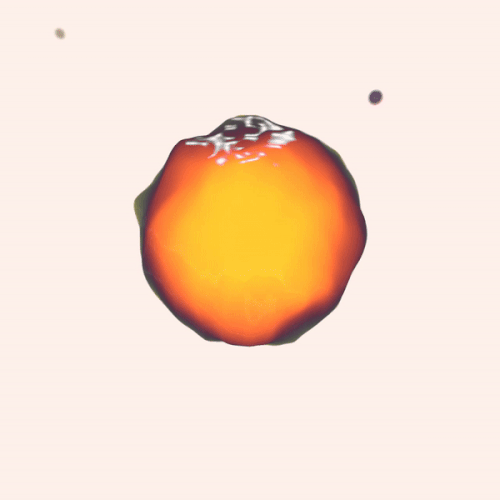
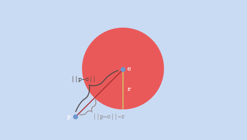
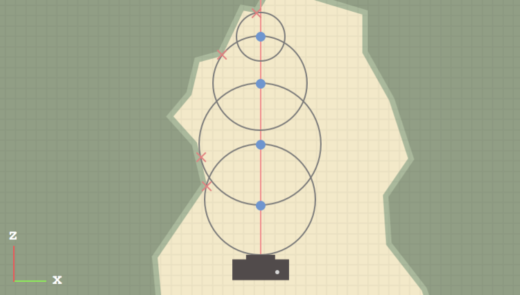
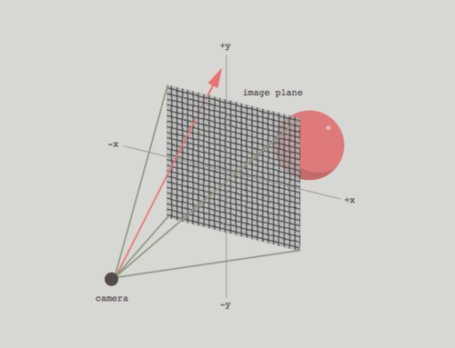
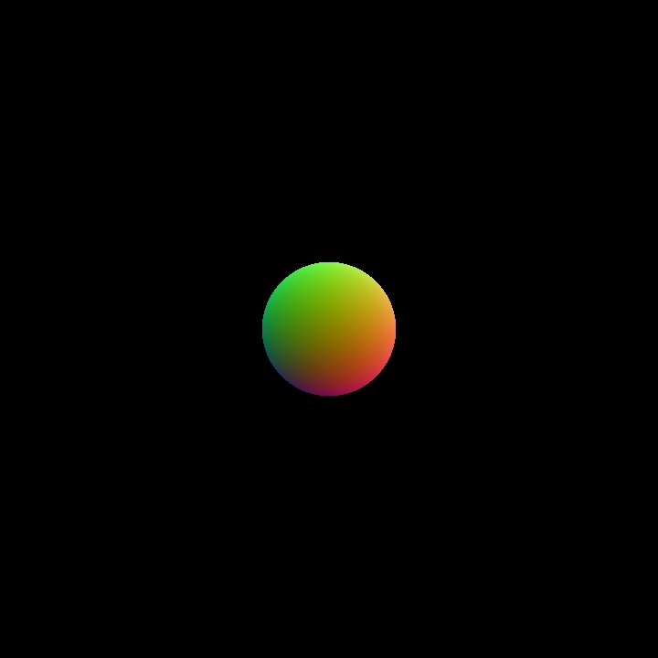
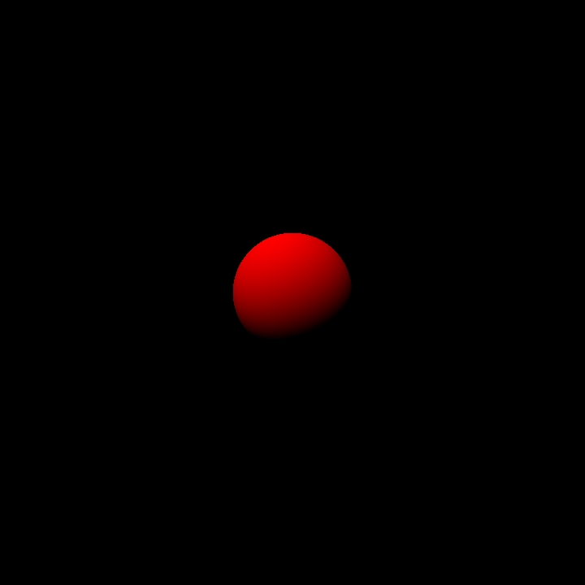

# Ray Marching

If you've ever visited Shadertoy, you've probably seen ray marching in action. It's an interesting technique that can be used to generate fully procedural environments entirely from a single fragment shader. Unfortunately, there aren't a ton of great resources for learning these techniques. So, I wanted to create a quick tutorial on setting up a basic ray marching shader. I will be using Derivative's TouchDesigner for rendering, but you should be able to port this to any other 3D environment fairly easily. In future blog posts, we will build upon the topics covered in this tutorial to create more interesting scenes!

> If you are working with TouchDesigner, all you will need for this tutorial is a single GLSL TOP. In the 
> "Common" tab, I changed the "Output Resolution" parameter from "Use Input" to "Custom Resolution," `720 x 720`.

<p align="center">
  
</p>

## Signed distance Functions

As I hinted at already, when we use ray marching, we aren't dealing with polygons anymore. So, a lot of the things that we're used to in a typical 3D toolkit - geometry, lights, cameras - are nonexistent. But if we don't have points, lines, triangles, and meshes, how do we render anything? The trick is to use [signed distance functions](https://en.wikipedia.org/wiki/Signed_distance_function) or SDFs (I will use these two terms interchangeably throughout this post). These are mathematical functions that take a point in space and tell you how far that point is from a surface. This can be somewhat confusing to wrap your head around, so maybe an example will help.

Let's say we are at a point `p` in 3D space. In GLSL, we can represent `p` as:

```glsl
vec3 p = vec3(x, y, z);
```

for some coordinates x, y, and z. Now, suppose we have a sphere centered at the origin with unit radius. We want to answer the question, "what is the distance from `p` to the **closest** point on the sphere?" It turns out that this distance corresponds to the length of the vector that points from `p` to the sphere's center, minus the sphere's radius. The following GLSL function implements this:

```glsl
// params:
// p: arbitrary point in 3D space
// c: the center of our sphere
// r: the radius of our sphere
float distance_from_sphere(in vec3 p, in vec3 c, float r)
{
	return length(p - c) - r;
}
```

And if you aren't convinced, check out the diagram below. Here, `||p - c||` denotes the length or norm of the vector `p - c`, which points from the center of the sphere `c` to `p`. Convince yourself that `||p - c|| - r` does, in fact, give us the distance from `p` to the closest point on the sphere. The code snippet above is our first signed distance function. This function is "signed" because it returns a negative value, zero, or a positive value, depending on whether we are inside, on the surface of, or outside the sphere, respectively. We can write these three cases:

### Case 1
`||p - c|| < r`, which means we are somewhere inside the sphere. This implies that
`||p - c|| - r` is negative.

### Case 2
`||p - c|| = r`, which means we are somewhere on the surface of the sphere. This implies that `||p - c|| - r` is zero.

### Case 3
`||p - c|| > r`, which means we are somewhere outside the sphere. This implies that `||p - c|| - r` is positive.

<p align="center">
  
</p>

Ok, so we have a basic SDF, and we know how to evaluate it at any point in 3D space. How do we actually use this to render something?

## Setting Up the Ray Marching Loop

In order to render our scene, we are going to use a technique called **ray marching**. At a high level, we will shoot out a bunch of imaginary rays from a virtual camera that is looking at our world. For each of these rays, we are going to "march" along the direction of the ray, and at each step, evaluate our SDF (the `distance_from_sphere` function that we wrote above). This will tell us: "from where I currently stand, how far am I from the closest point on the surface of our sphere?"

> If you are familiar with **ray tracing**, you might wonder why we can't just directly compute the point of 
> intersection between our ray and our sphere. For this simple scene, we actually could do this! However, as we will 
> see towards the end of this tutorial, the real power of ray marching lies in its ability to render shapes where this 
> exact point of intersection is not as obvious.

Now, our goal is to take steps along this ray until we are so close to an object that we can safely stop. But how should we move along the ray? One approach would be to take small, equally spaced steps. In GLSL, this might look like:

```glsl
const float step_size = 0.1;

for (int i = 0; i < NUMBER_OF_STEPS; ++i)
{
    // Assume that `ro` and `rd` are defined elsewhere
    // and represent the ray's origin and direction, 
    // respectively
    vec3 current_position = ro + (i * step_size) * rd;

    // Some code to evaluate our SDF and determine whether or not 
    // we've hit a surface based on our current position...
}
```

It turns out that a much better approach is to use **distance-aided ray marching** (sometimes called sphere tracing for reasons that we will see shortly). At each position along our ray, we evaluate our SDF, which, by definition, gives us the distance to the closest object in our scene. If we treat this distance as the radius of a sphere centered around our current position, we know that we can safely move forward along our ray by that amount without overshooting or missing any objects. These "bounding spheres" are represented by the four gray, stroked circles in the diagram below. Note that in practice, we might step many more times before terminating the ray.

The diagram below shows this process in action. Our first scene will be much simpler than this, but for illustration purposes, it's helpful to visualize a more complex shape. Here, we imagine that we have a top-down view of our world (we are viewing the XZ-plane). The dark gray box towards the bottom of the image represents our virtual camera, and the red line emanating from its lens represents a single ray. The green, mountain-like structure surrounding the camera represents some complex object (we assume that we have a SDF that represents this shape) that we are trying to render. Each position where we evaluate our SDF is represented by a small, blue circle. These points would be evaluated in the order drawn below, bottom to top. Each red X represents the point on the surface that is closest to the corresponding blue circle along the ray.

<p align="center">
  
</p>

There are two large optimizations that we can add to this. The first was already mentioned: if our SDF returns a very small distance (on the order of 0.001 for example), we will consider this a "hit" and break out of the loop early. The second involves rays that never pass through any objects in our scene. In our ray marching routine, we can keep track of the total distance traveled thus far and break out of the loop if we hit a certain threshold (say, 1000.0 units). So, our complete ray marching function might look something like:

```glsl
vec3 ray_march(in vec3 ro, in vec3 rd)
{
    float total_distance_traveled = 0.0;
    const int NUMBER_OF_STEPS = 32;
    const float MINIMUM_HIT_DISTANCE = 0.001;
    const float MAXIMUM_TRACE_DISTANCE = 1000.0;

    for (int i = 0; i < NUMBER_OF_STEPS; ++i)
    {
        // Calculate our current position along the ray
        vec3 current_position = ro + total_distance_traveled * rd;

        // We wrote this function earlier in the tutorial -
        // assume that the sphere is centered at the origin
        // and has unit radius
        float distance_to_closest = distance_from_sphere(current_position, vec3(0.0), 1.0);

        if (distance_to_closest < MINIMUM_HIT_DISTANCE) // hit
        {
            // We hit something! Return red for now
            return vec3(1.0, 0.0, 0.0);
        }

        if (total_distance_traveled > MAXIMUM_TRACE_DISTANCE) // miss
        {
            break;
        }

        // accumulate the distance traveled thus far
        total_distance_traveled += distance_to_closest;
    }

    // If we get here, we didn't hit anything so just
    // return a background color (black)
    return vec3(0.0);
}
```

So, we have a function that performs ray marching along a given ray. The last thing we need to figure out is, how do we generate our rays?

## Generating Rays

We know that a ray has two components: an origin and a direction. We are going to imagine that each ray starts at the camera and passes through an imaginary "image plane" that sits somewhere in front of our camera. Remember that all of our code will execute inside of a single fragment shader, so there is a bit of a leap, where we somehow have to describe a 3D world from the 2D plane that our fragment shader executes over. A fragment shader executes once for each pixel that makes up our final, rendered image. At each pixel location, we can derive a UV-coordinate in the range [0.0, 1.0]. In TouchDesigner, this is passed from the [vertex shader to the fragment shader](https://www.khronos.org/opengl/wiki/Type_Qualifier_(GLSL)#Shader_stage_inputs_and_outputs) as the variable `vUV.st`.

> If you are following along with this tutorial and not using TouchDesigner, the specifics of where your 
> UV-coordinates come from will be implementation defined. Regardless of what framework / toolkit you're using, you 
> just need to be able to draw a full-screen quad and calculate UV-coordinates, either by normalizing the built-in 
> variable `gl_FragCoord.xy`, or otherwise. Also, if you are rendering an image that is not square, you will need to 
> take into account your aspect ratio when deriving your UV-coordinates. For now, I'll leave this as an exercise...

Next, let's remap our UV-coordinates from the range [0.0, 1.0] to [-1.0, 1.0]. We do this largely for convenience, since it places the pixel at the center of our image at (0.0, 0.0). Now, in our imaginary 3D space, let's say that the camera is 5 units away from the origin, in the negative Z direction. To keep things simple, we aren't going to deal with things like FOV, camera rotation, etc., but we will likely cover some of these topics in the next tutorial.

<p align="center">
  
</p>

We already know that each ray originates from the camera. It's direction vector can be thought of as tracing a line from the camera's position through a point on the image plane. The following GLSL code snippet shows this process in action:

```glsl
// TouchDesigner provides this variable for us
vec2 uv = vUV.st * 2.0 - 1.0;

vec3 camera_position = vec3(0.0, 0.0, -5.0);
vec3 ro = camera_position;
vec3 rd = vec3(uv, 1.0);
```

The Z-coordinate of rd acts sort of like the camera's FOV, pushing the image plane closer to or further away from the camera (you can try adjusting this later on to see the effect). For now, we will leave this at 1.0. 

So, since each fragment has unique UV-coordinates, each execution of our fragment shader will generate a unique ray. Keep in mind that because of the way shaders execute on your graphics card, all of these calculations will be happening in parallel!

Now that we have a way to generate a unique ray at each pixel, we are (finally) ready to ray march!

## Putting It All Together

We now have all of the pieces we need to write our first, complete ray marching shader! At each pixel location, we will generate a ray, which we will use inside of our ray marching routine to map out our 3D environment. If you've been following along, the complete shader should look something like:

```glsl
out vec4 o_color;

float distance_from_sphere(in vec3 p, in vec3 c, float r)
{
    return length(p - c) - r;
}

vec3 ray_march(in vec3 ro, in vec3 rd)
{
    float total_distance_traveled = 0.0;
    const int NUMBER_OF_STEPS = 32;
    const float MINIMUM_HIT_DISTANCE = 0.001;
    const float MAXIMUM_TRACE_DISTANCE = 1000.0;

    for (int i = 0; i < NUMBER_OF_STEPS; ++i)
    {
        vec3 current_position = ro + total_distance_traveled * rd;

        float distance_to_closest = distance_from_sphere(current_position, vec3(0.0), 1.0);

        if (distance_to_closest < MINIMUM_HIT_DISTANCE) 
        {
            return vec3(1.0, 0.0, 0.0);
        }

        if (total_distance_traveled > MAXIMUM_TRACE_DISTANCE)
        {
            break;
        }
        total_distance_traveled += distance_to_closest;
    }
    return vec3(0.0);
}

void main()
{
    vec2 uv = vUV.st * 2.0 - 1.0;

    vec3 camera_position = vec3(0.0, 0.0, -5.0);
    vec3 ro = camera_position;
    vec3 rd = vec3(uv, 1.0);

    vec3 shaded_color = ray_march(ro, rd);

    o_color = vec4(shaded_color, 1.0);
}
```

## Shading

Now that we have our sphere, let's try to calculate some basic shading so that we can confirm that it is, indeed, a 3D surface! If you are familiar with diffuse / specular lighting, you probably know that we need normal vectors to calculate shading. For a sphere, the normal at any point on the surface can be calculated by simply normalizing the vector `c - p`, where as before, `c` is the sphere's center, and `p` is a point on the surface of the sphere. However, this method is limiting (it certainly doesn't extend to other shapes), and as we will see in the next section, when we deform our SDF, we need a more dynamic way of calculating normals.

The idea is, we can "nudge" our point p slightly in the positive and negative direction along each of the X/Y/Z axes, recalculate our SDF, and see how the values change. If you are familiar with vector calculus, we are essentially calculating the [gradient](https://en.wikipedia.org/wiki/Gradient) of the distance field at p. In 2D, you might be familiar with the **derivative**, which gives the rate of change of a function with respect to its input. You might also have seen this visualized as the slope of the line that lies [tangent to the function](https://en.wikipedia.org/wiki/Derivative) at some point. The gradient is just the extension of this to functions of multiple dimensions (our SDF has 3 dimensions, X/Y/Z). Normals should generally be unit vectors, so we'll normalize it as well. This method lets us to calculate normals for arbitrarily complex objects, provided we have the appropriate SDF to represent its surface.

> I realize this explanation is a bit "hand-wavy" at the moment! It took me a while to understand how and why 
> this way of calculating normals works. I recommend sitting with the code for a bit - after some reflection, it 
> should start to make sense. I am working on a better way to explain / illustrate this and will hopefully update 
> this post in the future with a more concrete explanation.

Before we calculate normals, let's quickly write a function that will allow us to accommodate more than one shape in preparation for future posts:

```glsl
float map_the_world(in vec3 p)
{
    float sphere_0 = distance_from_sphere(p, vec3(0.0), 1.0);

    // Later we might have sphere_1, sphere_2, cube_3, etc...

    return sphere_0;
}
```

And modify the ray marching loop to call this function instead of the `distance_from_sphere` function directly:

```glsl
...

float distance_to_closest = map_the_world(current_position);

...
```

Now, we will write our function to calculate normals, which will call `map_the_world` six times: 

```glsl
vec3 calculate_normal(in vec3 p)
{
    const vec3 small_step = vec3(0.001, 0.0, 0.0);

    float gradient_x = map_the_world(p + small_step.xyy) - map_the_world(p - small_step.xyy);
    float gradient_y = map_the_world(p + small_step.yxy) - map_the_world(p - small_step.yxy);
    float gradient_z = map_the_world(p + small_step.yyx) - map_the_world(p - small_step.yyx);

    vec3 normal = vec3(gradient_x, gradient_y, gradient_z);

    return normalize(normal);
}
```

If you are unfamiliar with [swizzling](https://www.khronos.org/opengl/wiki/Data_Type_(GLSL)#Swizzling) in GLSL, we are basically using some syntactic "sugar" to add and subtract the X-coordinate of the variable small_step (which is 0.001) to each of the X/Y/Z coordinates of our original point p in succession. So the value of gradient_y, for example, is calculated by adding and subtracting 0.001 from only the Y-coordinate of p, then calling map_the_world at these two new points. Now, back inside of our ray marching loop, if we hit an object, we can calculate the normal at that point. Let's visualize our normals as RGB colors to verify that the code is working as expected:

```glsl
...

if (distance_to_closest < MINIMUM_HIT_DISTANCE) 
{
    vec3 normal = calculate_normal(current_position);

    // Remember, each component of the normal will be in 
    // the range -1..1, so for the purposes of visualizing
    // it as an RGB color, let's remap it to the range
    // 0..1
    return normal * 0.5 + 0.5;
}

...
```

<p align="center">
  
</p>

We can take this one step further and calculate some simple diffuse lighting:

```glsl
...

if (distance_to_closest < MINIMUM_HIT_DISTANCE) 
{
    vec3 normal = calculate_normal(current_position);

    // For now, hard-code the light's position in our scene
    vec3 light_position = vec3(2.0, -5.0, 3.0);

    // Calculate the unit direction vector that points from
    // the point of intersection to the light source
    vec3 direction_to_light = normalize(current_position - light_position);

    float diffuse_intensity = max(0.0, dot(normal, direction_to_light));

    return vec3(1.0, 0.0, 0.0) * diffuse_intensity;
}

...
```

So, your complete shader should look something like:

```glsl
out vec4 o_color;

float distance_from_sphere(in vec3 p, in vec3 c, float r)
{
    return length(p - c) - r;
}

float map_the_world(in vec3 p)
{
    float sphere_0 = distance_from_sphere(p, vec3(0.0), 1.0);

    return sphere_0;
}

vec3 calculate_normal(in vec3 p)
{
    const vec3 small_step = vec3(0.001, 0.0, 0.0);

    float gradient_x = map_the_world(p + small_step.xyy) - map_the_world(p - small_step.xyy);
    float gradient_y = map_the_world(p + small_step.yxy) - map_the_world(p - small_step.yxy);
    float gradient_z = map_the_world(p + small_step.yyx) - map_the_world(p - small_step.yyx);

    vec3 normal = vec3(gradient_x, gradient_y, gradient_z);

    return normalize(normal);
}

vec3 ray_march(in vec3 ro, in vec3 rd)
{
    float total_distance_traveled = 0.0;
    const int NUMBER_OF_STEPS = 32;
    const float MINIMUM_HIT_DISTANCE = 0.001;
    const float MAXIMUM_TRACE_DISTANCE = 1000.0;

    for (int i = 0; i < NUMBER_OF_STEPS; ++i)
    {
        vec3 current_position = ro + total_distance_traveled * rd;

        float distance_to_closest = map_the_world(current_position);

        if (distance_to_closest < MINIMUM_HIT_DISTANCE) 
        {
            vec3 normal = calculate_normal(current_position);
            vec3 light_position = vec3(2.0, -5.0, 3.0);
            vec3 direction_to_light = normalize(current_position - light_position);

            float diffuse_intensity = max(0.0, dot(normal, direction_to_light));

            return vec3(1.0, 0.0, 0.0) * diffuse_intensity;
        }

        if (total_distance_traveled > MAXIMUM_TRACE_DISTANCE)
        {
            break;
        }
        total_distance_traveled += distance_to_closest;
    }
    return vec3(0.0);
}

void main()
{
    vec2 uv = vUV.st * 2.0 - 1.0;

    vec3 camera_position = vec3(0.0, 0.0, -5.0);
    vec3 ro = camera_position;
    vec3 rd = vec3(uv, 1.0);

    vec3 shaded_color = ray_march(ro, rd);

    o_color = vec4(shaded_color, 1.0);
}
```

<p align="center">
  
</p>

## Distorting the Distance Function

Now, for the cool part! Once we have a basic ray marching setup, we can "nudge" or perturb our distance functions to create more interesting shapes. For example, we can add a sinusoidal distortion to our sphere's SDF by modifying the map_the_world function like so:

```glsl
float map_the_world(in vec3 p)
{
    float displacement = sin(5.0 * p.x) * sin(5.0 * p.y) * sin(5.0 * p.z) * 0.25;
    float sphere_0 = distance_from_sphere(p, vec3(0.0), 1.0);

    return sphere_0 + displacement;
}
```

<p align="center">
  
</p>

You can play around with this effect: try using other combinations of sin and cos based on the coordinates of the position vector `p` to generate a displacement value. If you are working with a toolkit that implements GLSL noise functions (or you want to implement them yourself), you can try perturbing `p` with noise as well.

Since we calculate our normals dynamically, the lighting should still be correct, regardless of how we deform our shape!

## Conclusion

Anyways, I hope this helps you get started with ray marching! I realize that the end results aren't quite as stunning as you might've hoped, but now that we have a solid framework to build upon, it's not too much more work to add things like:

- Multiple shapes
- CSG operations (unions, intersections, subtractions, etc.)
- Animated cameras
- Shadows and/or ambient occlusion

These are all things that I hope to cover in future posts! If you want to start exploring on your own, I recommend taking a look at [Inigo Quilez's](http://www.iquilezles.org/www/articles/distfunctions/distfunctions.htm) website for inspiration.

[back](./)