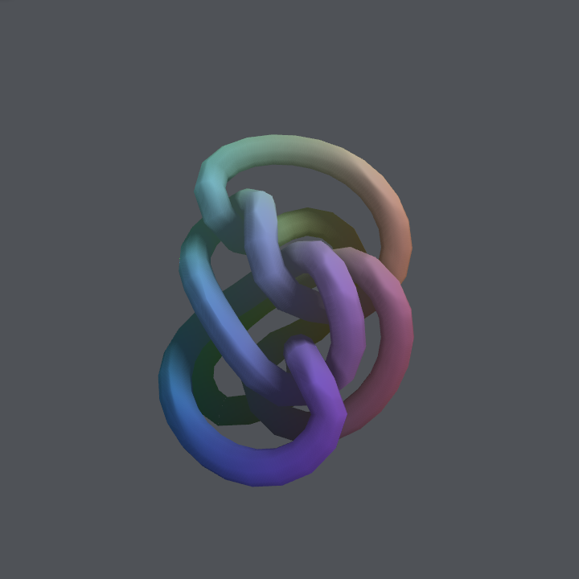
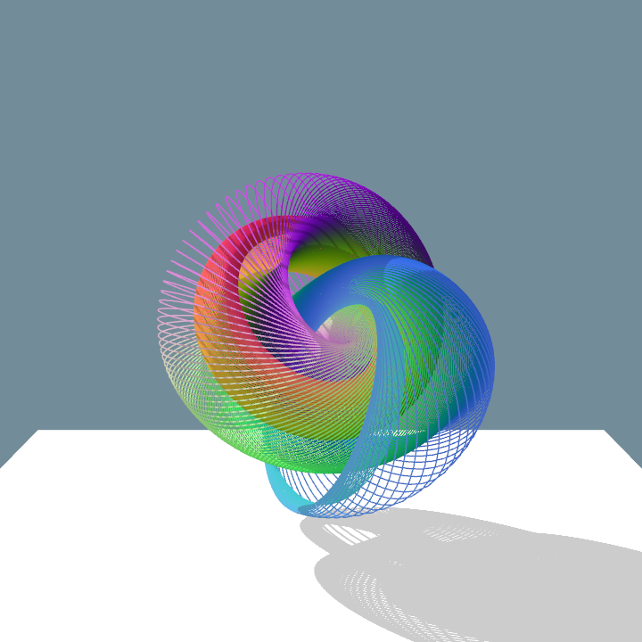
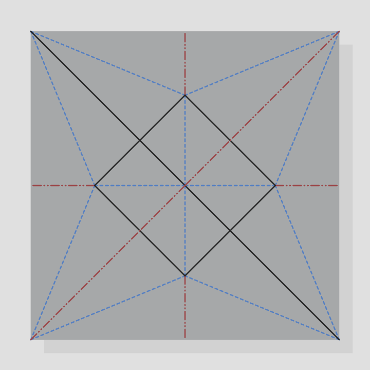
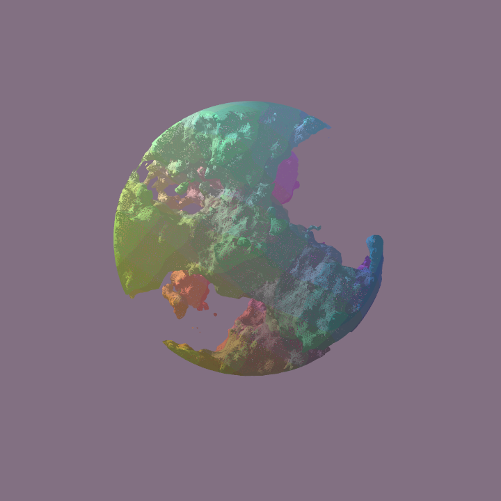
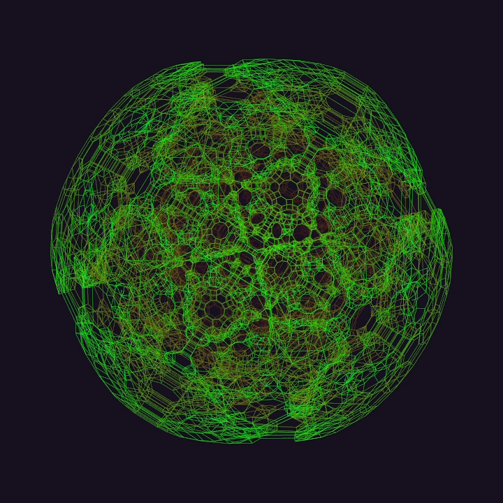
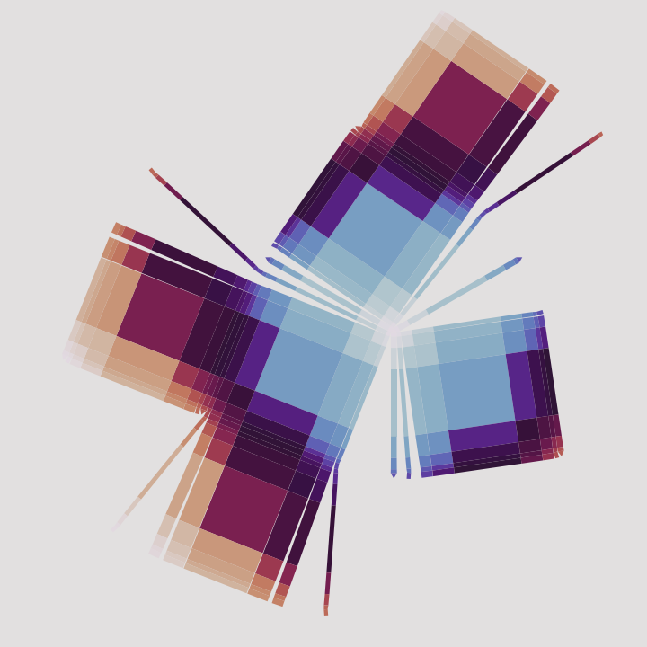
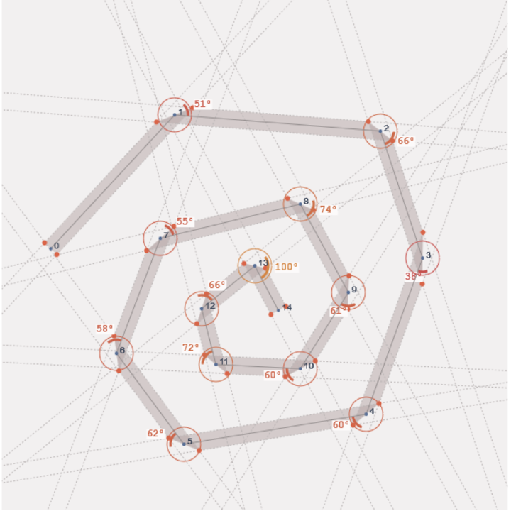
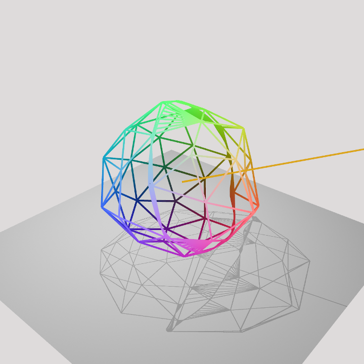

## Projects

<table style="width:100%">

  <tr>
    <td style="width:33%">
      
    </td>
    <td style="width:33%">
      
    </td>
    <td style="width:33%">
      
    </td>
  </tr>

  <tr>
    <td style="width:33%">
      
    </td>
    <td style="width:33%">
      
    </td>
    <td style="width:33%">
      
    </td>
  </tr>

  <tr>
    <td style="width:33%">
      
    </td>
  </tr>

</table>

## Ongoing Research

<table style="width:100%">

  <tr>
    <td style="width:33%">
      
    </td>
    <td style="width:33%">
      
    </td>
    <td>
      
    </td>
  </tr>

</table>

## Blog Posts

[Ray Marching](./blog-ray-marching.html) 
[Learning Origami](./blog-learning-origami.html)

## About

I am a software engineer and media artist currently based in Portland, Oregon. I build custom software that explores topics like computational origami, knot theory, geometry, and folding.

I graduated from the [Digital Media Design](https://catalog.upenn.edu/undergraduate/programs/digital-media-design-bse/) program at the University of Pennsylvania, an interdisciplinary major that blends computer science and art. I also minored in music. I attended the spring 2015 session of [The School for Poetic Computation](https://sfpc.io/): an artist run school in NYC that explores the intersections of hardware, code, and poetry. Recently, I finished a 3-year stint as an interactive developer at [Obscura Digital](https://www.msg.com/obscura-digital) in San Francisco and now work as an independent contractor and consultant.

In my free time, I study Hindustani classical music (sitar) with [Josh Feinberg](https://www.joshsitar.com/), fold origami, study mathematics and geometry, learn languages (currently learning Japanese), and compose electronic music.

This website showcases a few of my personal projects. I also post experiments and works-in-progress on my [Instagram](https://www.instagram.com/mwalczyk/) account.

