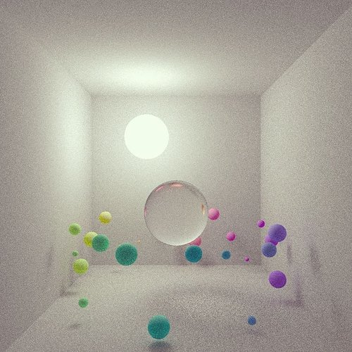

# Flow
🔮 A GPU-based progressive path tracer written in Vulkan. 

  

## Description

`flow` is a minimal, progressive path tracer implemented in Vulkan with GLSL shaders. It renders a small group of implicit surfaces (spheres, boxes, planes, etc.) with several different material models (primarily lambertian, metallic, and dielectric).

For the time being, `flow` uses a single render pass instance with two distinct subpasses. The first subpass involves two floating-point images in a "ping-pong" arrangement. This is how the light accumulates over the course of many frames, leading to a well-converged image. Whichever of the two images was used as a color attachment during this first subpass serves as an input attachment to the next (and final) subpass. Input attachments are unique to Vulkan and allow a render pass attachment to be read in a fragment shader stage during a subpass. Input attachments come with several restrictions and do not support random access like a typical `sampler2D`, for example.

The second subpass simply reads from this input attachment and writes to one of the swapchain images that are presented to the screen. 

As such, there are two separate graphics pipelines - one that runs the main path tracing routine and another that normalizes the accumulated light (converts it from HDR to `[0..1]`) and writes to the corresponding swapchain image.

Built on top of [vkstarter](https://github.com/mwalczyk/vkstarter).

  
  
  

Separately, as part of a R&D initiative for Obscura Digital, I was tasked with investigating NVIDIA’s new RTX graphics card line. One of the primary features enabled by the RTX cards is support for real-time raytracing. 

Using C++ and the new Vulkan raytracing extensions, I created a sample app to demonstrate this new functionality. RTX introduces 5 new shader stages (3 of which are required) as part of a new raytracing-specific pipeline object. Geometry is uploaded into GPU-side buffers from which an acceleration structure is constructed to aid in efficient ray-triangle intersection calculations.

My application supported basic implicit surfaces (spheres and planes) as well as .obj loading via tinyobjloader (an external C++ header-only library). 

The first example demonstrates a simple raytracer with direct lighting only. The second example demonstrates a path tracer, which calculates direct and indirect lighting via Monte Carlo sampling, which, of course, leads to visible noise in the final render.

  

  

On numerous occasions, I have experimented with small, GLSL-based path tracers. Another example can be seen below, along with the corresponding GLSL fragment shader code. At some point, I would love to consolidate my research and build a more fully featured global illumination renderer.

  

[back](./)